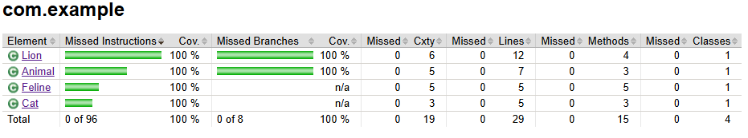

## Проект 6 спринта
## Тестовый проект на Java с использованием JUnit, Mockito и Jacoco

## 📋 Описание проекта
Проект содержит unit-тесты для классов `Feline`, `Cat` и `Lion` с использованием:
- **JUnit 4** для написания тестов
- **Mockito** для создания моков и проверки взаимодействий
- **Jacoco** для измерения покрытия кода тестами
- **JUnit Parameterized Tests** для параметризованного тестирования

## 🎯 Цели проекта
1. Демонстрация принципа **инъекции зависимостей** (Dependency Injection)
2. Написание **моков с помощью Mockito**
3. Создание **параметризованных тестов**
4. Достижение **100% покрытия кода** с помощью Jacoco
5. Практика **тестирования взаимодействия** между объектами

📈 Покрытие кода Jacoco
Проект настроен для получения 100% покрытия классов:

#### `Feline`
#### `Cat`
#### `Lion`

# Запуск тестов
`mvn clean verify`

### Проверка покрытия кода

`mvn jacoco:report`
### Отчёт будет доступен в `target/site/jacoco/index.html`

`Емельянов Николай`